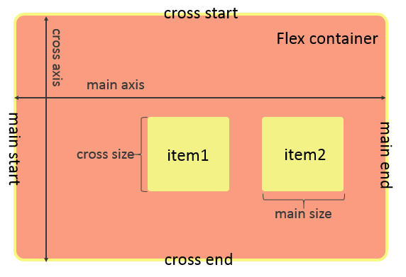

#CSS 概念和实践

### 1. css 鼠标悬浮才显示的样式

`要求实现`：正常情况下，a 链接不显示，只有鼠标移到到上面或者 a 的父元素上才显示

_html 代码_

```html
<div>
  <span class="text-right">
    <a>详情</a>
  </span>
</div>
```

_css 代码_

```css
.text-right a {
  color: transparent; /*透明无颜色*/
}
div:hover a {
  color: #333; /*鼠标悬浮时要显示的颜色*/
  cursor: pointer;
}
```

_效果图如下_


### 2. 水印样式

_html 代码_

```html
<div>
  <div class="waterMark">
    <p>抽</p>
  </div>
</div>
```

_css 代码_

```css
div.page {
  height: 80mm;
  width: 100mm;
  overflow: hidden;
  margin: 2mm 2mm;
  border: 1px solid #ccc;
  padding: 3mm;
  padding-top: 0;
  display: inline-block;
}

/*水印图形*/
.waterMark {
  position: absolute;
  border: 5px solid #000;
  border-radius: 30mm;
  width: 24mm;
  height: 24mm;
  text-align: center;
  line-height: 24mm;
  font-weight: 900;
  font-size: 12mm;
  opacity: 0.15;
  transform: translate(269%, 182%);
}

/*水印文字*/
.waterMark p {
  transform: rotate(
    -30deg
  ); /*控制水印旋转角度，这里为 -30 度（逆时针旋转30°）*/
  -moz-transform: rotate(-30deg);
  -webkit-transform: rotate(-30deg);
  margin: -5px 0 10px;
}
```

_效果图_


### 3.对角线渐变色

```html
<body>
  <h3>线性渐变 - 从上到下</h3>
  <p>从顶部开始的线性渐变。起点是红色，慢慢过渡到蓝色：</p>
  <div id="grad1"></div>
  <p><strong>注意：</strong> Internet Explorer 9 及之前的版本不支持渐变。</p>
</body>
```

```css
#grad1 {
  height: 200px;
  background: -webkit-linear-gradient(
    45deg,
    #e37682 15%,
    #5f4d93 85%
  ); /* Safari 5.1 - 6.0 */
  background: -o-linear-gradient(
    45deg,
    #e37682 15%,
    #5f4d93 85%
  ); /* Opera 11.1 - 12.0 */
  background: -moz-linear-gradient(
    45deg,
    #e37682 15%,
    #5f4d93 85%
  ); /* Firefox 3.6 - 15 */
  background: linear-gradient(
    45deg,
    #e37682 15%,
    #5f4d93 85%
  ); /* 标准的语法（必须放在最后） */
}
```

_效果图_


**详情查看:[菜鸟教程渐变色](http://www.runoob.com/css3/css3-gradients.html)**

### 4. 边框呼吸灯

代码如下：

```html
<!DOCTYPE html>
<html lang="en">
  <head>
    <meta charset="UTF-8" />
    <title>Document</title>
    <style>
      .selectedTdForMap {
        border-width: 3px;
        border-style: solid;
        animation: myflash linear 0.6s infinite alternate;
      }

      @keyframes myflash {
        0% {
          border-color: #f00;
        }

        100% {
          border-color: #f5c2c2;
        }
      }
    </style>
  </head>

  <body>
    <div class="selectedTdForMap" style="width:200px;height:140px;"></div>
  </body>
</html>
```

### 5. Flex（flexible box：弹性布局盒模型）

_flex 相关概念示意图：_


_flex 属性总结表_


- `flex`是 2009 年 w3c 提出的一种可以简洁、快速弹性布局的属性。**主要思想是给予容器控制内部元素高度和宽度的能力**;
- 其中在 webkit 内核的浏览器中使用时，必须加上`-webkit-`前缀;
- 弹性布局元素之间默认没有间隔;
- 弹性布局默认不改变项目的宽度,但是默认改变项目的高度,align-self 属性可以改变这种行为;
- 弹性布局默认左对齐，所以两个控件会从行首开始排列;
- 如果我们希望，输入框占据当前行的所有剩余宽度，只需要指定输入框的`flex-grow`属性为`1`;
- 如果项目很多，一个个地设置`align-self`属性就很麻烦。这时，可以在容器元素（本例为表单）设置`align-items`属性，它的值被所有子项目的`align-self`属性继承。;
- 需注意使用 flex 容器内元素，即`flex item`的`float，clear、vertical-align`属性将失效。

参考链接：https://www.cnblogs.com/nuannuan7362/p/5823381.html

### 6. 使用 Flex 布局实现子元素相对父容器的水平垂直居中

```css
.parent {
  width: 200px;
  height: 100px;
  position: relative;
  background-color: #374858;
}
.item {
  width: 100px;
  height: 50px;
  background-color: #9dc3e6;
}
.parent {
  display: flex;
  justify-content: center;
  align-items: center;
}
```

如图：


### 7.CSS 三角形

[flexProps](./examples/cssTriangle.html)

### 8.BFC

> BFC(Block formatting context)直译为"块级格式化上下文"。
> 它是一个独立的渲染区域，只有 Block-level box 参与，
> 它规定了内部的 Block-level Box 如何布局，并且与这个区域外部毫不相干。

- BFC 布局规则
  - 内部的 Box 会在垂直方向，一个接一个地放置
  - Box 垂直方向的距离由 margin 决定。属于同一个 BFC 的两个相邻 Box 的 margin 会发生重叠
  - 每个元素的 margin box 的左边， 与包含块 border box 的左边相接触(对于从左往右的格式化，否则相反)。即使存在浮动也是如此
  - BFC 的区域不会与 float box 重叠
  - BFC 就是页面上的一个隔离的独立容器，容器里面的子元素不会影响到外面的元素。反之也如此
  - 计算 BFC 的高度时，浮动元素也参与计算
- BFC 功能
  - 清楚浮动，使 BFC 内部浮动元素不会到处乱跑
  - 和浮动元素产生边界，避免和浮动元素重叠
- BFC 触发条件
  - <html\> 根元素
  - float 属性不为 none
  - overflow 不为 visible(可以是 hidden、scroll、auto)
  - position 为 absolute 或 fixed
  - display 为 inline-block、table-cell、table-caption

### 9.text-transform

使用 css 的 text-transform 属性可以实现英文大小写定制。

```css
//英文转换成大写
.toUppercase {
  text-transform: uppercase;
}
//英文转换成小写
.toLowercase {
  text-transform: lowercase;
}
```

### 10.控制滚动轴样式
html代码
```html
<div class="box"></div>
```
css代码
```css
.box:hover ::-webkit-scrollbar-thumb{
  display:block;
}
/* 滚动条整体样式 */
.box::-webkit-scrollbar{
  width:4px;
}
/* 滑块样式 */
.box::-webkit-scrollbar-thumb{
  border-radius:4px;
  -webkit-box-shadow:inset 0 0 5px rgba(0,0,0,0.2);
  background-color:#d9d9d9;
  display:none;
}
/* 滚动条轨道 */
.box::-webkit-scrollbar-track{
  -webkit-box-shadow:inset 0 0 1px rgba(0,0,0,0);
  border-radius:4px;
  background-color:transparent;
}
```
最终效果如下图：


### 11.CSS斜纹
```html
 <div class="twill-container">
  <!--background-size控制斜纹的粗细-->
  <div class="twill"></div>
 </div>
```
```css
.twill-container{
  height: 14px;
  width:14px;
  font-size: 14px;
  text-align: left;
  display: inline-block;
}
.twill-container .twill{
  height: 14px;
  width: 100%;
  background-color:'#FF526C';
  background-image: -webkit-gradient(linear, 0 0, 100% 100%,
  color-stop(.25, rgba(255, 255, 255, .2)), color-stop(.25, transparent),
  color-stop(.5, transparent), color-stop(.5, rgba(255, 255, 255, .2)),
  color-stop(.75, rgba(255, 255, 255, .2)), color-stop(.75, transparent),
  to(transparent));
  background-image: -moz-linear-gradient(-45deg, rgba(255, 255, 255, .2) 25%, transparent 25%,
  transparent 50%, rgba(255, 255, 255, .2) 50%, rgba(255, 255, 255, .2) 75%,
  transparent 75%, transparent);
  background-image: -o-linear-gradient(-45deg, rgba(255, 255, 255, .2) 25%, transparent 25%,
  transparent 50%, rgba(255, 255, 255, .2) 50%, rgba(255, 255, 255, .2) 75%,
  transparent 75%, transparent);
  background-image: linear-gradient(
          -45deg,
          rgba(255, 255, 255, .3) 25%, transparent 25%,
          transparent 50%, rgba(255, 255, 255, .3) 50%,
          rgba(255, 255, 255, .3) 75%, transparent 75%,
          transparent
  );
  background-size: 4px 4px;
}
```
最终效果：

