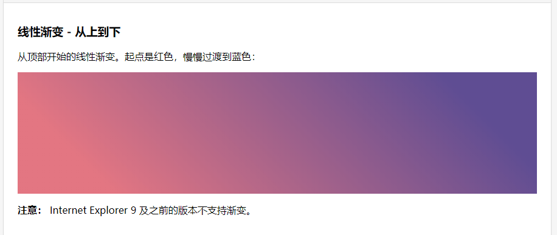

#CSS 常用技巧

### 1. css 鼠标悬浮才显示的样式
`要求实现`：正常情况下，a 链接不显示，只有鼠标移到到上面或者 a  的父元素上才显示

*html 代码*
```html
<div>
    <span class="text-right">
        <a>详情</a>
    </span>
</div>
```

*css 代码*
```css
.text-right a{
    color:transparent;  /*透明无颜色*/
}
div:hover a{
    color:#333; /*鼠标悬浮时要显示的颜色*/
    cursor:pointer;
}
```

*效果图如下*


### 2. 水印样式
*html 代码*
```html
<div>
    <div class="waterMark">
        <p>抽</p>
    </div>
</div>
```

*css 代码*
```css

div.page{
    height: 80mm;
    width: 100mm;
    overflow: hidden;
    margin: 2mm 2mm;
    border: 1px solid #ccc;
    padding: 3mm;
    padding-top: 0;
    display: inline-block;
}

/*水印图形*/
.waterMark {
    position: absolute;
    border: 5px solid #000;
    border-radius: 30mm;
    width: 24mm;
    height: 24mm;
    text-align: center;
    line-height: 24mm;
    font-weight: 900;
    font-size: 12mm;
    opacity: 0.15;
    transform: translate(269%,182%);
}

/*水印文字*/
.waterMark p {
    transform: rotate(-30deg);  /*控制水印旋转角度，这里为 -30 度（逆时针旋转30°）*/
    -moz-transform: rotate(-30deg);
    -webkit-transform: rotate(-30deg);
    margin: -5px 0 10px;
}
```

*效果图*


### 3.对角线渐变神色
```html
<body>
    <h3>线性渐变 - 从上到下</h3>
    <p>从顶部开始的线性渐变。起点是红色，慢慢过渡到蓝色：</p>
    <div id="grad1"></div>
    <p><strong>注意：</strong> Internet Explorer 9 及之前的版本不支持渐变。</p>
</body>
```
```css
#grad1 {
    height: 200px;
    background: -webkit-linear-gradient(45deg, #e37682 15%, #5f4d93 85%); /* Safari 5.1 - 6.0 */
    background: -o-linear-gradient(45deg, #e37682 15%, #5f4d93 85%); /* Opera 11.1 - 12.0 */
    background: -moz-linear-gradient(45deg, #e37682 15%, #5f4d93 85%); /* Firefox 3.6 - 15 */
    background: linear-gradient(45deg, #e37682 15%, #5f4d93 85%); /* 标准的语法（必须放在最后） */
}
```
*效果图*


**详情查看:[菜鸟教程渐变色](http://www.runoob.com/css3/css3-gradients.html)**
