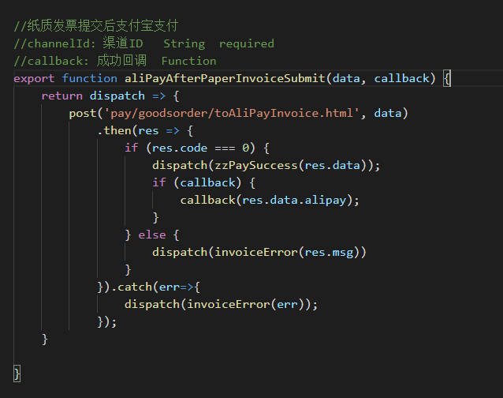

# 前端作业指导书

版本  |  编制日期  |  修订日期  |  编制人
---|:--|:--:|---:
V1.0  | 2018/12/13 |          |  蒋创事

##1.代码规范
###1.1.代码风格
* 变量命名不要求简短，要求见名知意，遵循“驼峰”命名规范；
* 一个方法不要超过 **30** 行，方法用途，方法参数格式和含义要在方法前面注释清楚；
    >例如：


* 组件命名，使用 `React` 官方推荐的大写形式，`MIME` 类型为 `js`（为了便于浏览器调试工具调试）；
    组件内部方法编写顺序：
* 生命周期 函数在前，按照组件实际生命周期排序。
* 事件处理 函数跟在生命周期函数后，以 `handle` 开头，比如 `handleBtnClick(){}` ；
* 私有方法 写在组最后，以下划线开头，比如 `_sortByKey(){}` ；
* `if-else` 判断不要超过三个轮次，否则使用 `switch-case`。


###1.2.注释问题
* 每个组件开头，引入组件之前，写明该**组件的注释**（多行注释形式），指明**组件功能**，使用时的注意点（有就注明，没有可以不写）；
>例如：
```javascript
/* 
* 名 称: Login 
* 功 能: 登录模块，登录验证 
* 注意点：
*  ......
*/
class Login extends React.Component{
    ......
}
```


* 组件的 `state` ,每个字段注释（单行注释）含义，字段命名参考 1.1 代码风格部分；
* 组件的 `props` 需要引入 `prop-types` 验证。


##2.版本控制
#### 2.1.SVN
* 更新的及时性：每天上班开始工作前更新代码，开始**修改一个文件前**，更新代码；
* 提交的及时性：**修改一个文件完成后**，提交代码，`SVN`上写清提交说明,每天下班前再提交代码；
* 开发新版本时，需要封存源代码，开启新分支，不要再原分支上继续修改。
#### 2.2.Git
*此部分多在和外包对接时使用*
* 我方在“码云”上初始化一个仓库，仓库根目录下新建 `README.md` 文件，里头以 `markdown` 形式书写**项目介绍**，使用的**技术栈**（具体技术栈需要双方商量）；
* 承包方在我方新建仓库基础上添加或编辑代码，如承包方新建分支，在编码工作完成后，需要承包方**合并**到主分支，合并内容是**整体源码**（需要检查业务代码是否完整），而非仅仅是编译后的文件；
* 主分支确认无误后，需要删除主分支以外的其他分支，来保证以后不会混淆；
* 合并完成后，我方需要克隆项目到本地来运行，保证 0 报错，保证编译通过；


##3.接口沟通
* 参考后端给出的 `showDoc` 格式的接口文档，存在疑问的部分可以直接与接口开发者**当面交流**；
* 打包部署后，要**确保后端开启针对我站文件格式的 `gzip` 压缩**，这样减小传输文件大小，提高站点加载速度；

##4.外包对接
>参照 2.版本控制 -- 2.2.Git 部分

另外：
* 后端提供给承包方完整的 **接口文档** ；
* 遇到责任方不清楚的问题，**查看**和承包方签署的**合同**。